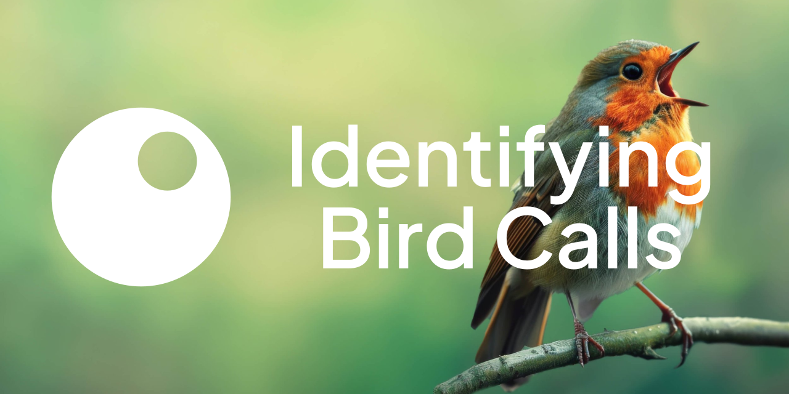

[](https://teamepoch.ai/competitions#Bird)

[](https://teamepoch.ai/)
[![Kaggle Badge](https://img.shields.io/badge/-BirdCLEF_2024-20beff.svg?logo=data:image/svg+xml;base64,PD94bWwgdmVyc2lvbj0iMS4wIiBlbmNvZGluZz0iVVRGLTgiIHN0YW5kYWxvbmU9Im5vIj8+CjxzdmcKICAgd2lkdGg9IjY0IgogICBoZWlnaHQ9IjY0IgogICB2aWV3Qm94PSIwIDAgMzIgMzIiCiAgIHZlcnNpb249IjEuMSIKICAgaWQ9InN2ZzEiCiAgIHhtbG5zOnhsaW5rPSJodHRwOi8vd3d3LnczLm9yZy8xOTk5L3hsaW5rIgogICB4bWxucz0iaHR0cDovL3d3dy53My5vcmcvMjAwMC9zdmciCiAgIHhtbG5zOnN2Zz0iaHR0cDovL3d3dy53My5vcmcvMjAwMC9zdmciPgogIDxkZWZzCiAgICAgaWQ9ImRlZnMxIj4KICAgIDxjbGlwUGF0aAogICAgICAgaWQ9IkEiPgogICAgICA8dXNlCiAgICAgICAgIHhsaW5rOmhyZWY9IiNCIgogICAgICAgICBpZD0idXNlMSIgLz4KICAgIDwvY2xpcFBhdGg+CiAgICA8cGF0aAogICAgICAgaWQ9IkIiCiAgICAgICBkPSJNMzEuNSAxNS45NzhoMjg5djEzMC4wNDRoLTI4OXoiIC8+CiAgPC9kZWZzPgogIDxwYXRoCiAgICAgdHJhbnNmb3JtPSJtYXRyaXgoLjUyNzAyNyAwIDAgLjUyNzAyNyAtMzAuNjMyMjg4IC0yMi40NTU1OSkiCiAgICAgY2xpcC1wYXRoPSJ1cmwoI0EpIgogICAgIGQ9Ik0xMDUuNzUgMTAyLjk2OGMtLjA2LjIzOC0uMjk4LjM1Ny0uNzEzLjM1N0g5Ny4xYy0uNDc3IDAtLjg5LS4yMDgtMS4yNDgtLjYyNUw4Mi43NDYgODYuMDI4bC0zLjY1NSAzLjQ3N3YxMi45M2MwIC41OTUtLjI5OC44OTItLjg5Mi44OTJoLTYuMTUyYy0uNTk1IDAtLjg5Mi0uMjk3LS44OTItLjg5MlY0My41YzAtLjU5My4yOTctLjg5Ljg5Mi0uODlINzguMmMuNTk0IDAgLjg5Mi4yOTguODkyLjg5djM2LjI4OGwxNS42OTItMTUuODdjLjQxNi0uNDE1LjgzMi0uNjI0IDEuMjQ4LS42MjRoOC4yMDRjLjM1NiAwIC41OTMuMTUuNzEzLjQ0NS4xMi4zNTcuMDkuNjI0LS4wOS44MDNMODguMjc0IDgwLjU4OGwxNy4yOTcgMjEuNDg4Yy4yMzcuMjM4LjI5Ny41MzUuMTguODkyIgogICAgIGZpbGw9IiMyMGJlZmYiCiAgICAgaWQ9InBhdGgxIgogICAgIHN0eWxlPSJmaWxsOiNmZmZmZmYiIC8+Cjwvc3ZnPgo=)](https://www.kaggle.com/competitions/birdclef-2024/)
[![Python Version](https://img.shields.io/badge/Python-3.10-4584b6.svg?logo=data:image/svg+xml;base64,PHN2ZyB4bWxucz0iaHR0cDovL3d3dy53My5vcmcvMjAwMC9zdmciIHdpZHRoPSI2NCIgaGVpZ2h0PSI2NCIgdmlld0JveD0iMCAwIDMyIDMyIj48ZGVmcz48bGluZWFyR3JhZGllbnQgaWQ9IkEiIHgxPSI4MTEuNTI3IiB5MT0iNTc0Ljg5NSIgeDI9IjY2NS4yNTUiIHkyPSI1NzMuNzMyIiBncmFkaWVudFVuaXRzPSJ1c2VyU3BhY2VPblVzZSI+PHN0b3Agb2Zmc2V0PSIwIiBzdG9wLWNvbG9yPSIjMzY2YTk2Ii8+PHN0b3Agb2Zmc2V0PSIxIiBzdG9wLWNvbG9yPSIjMzY3OWIwIi8+PC9saW5lYXJHcmFkaWVudD48bGluZWFyR3JhZGllbnQgaWQ9IkIiIHgxPSI4NjIuODI0IiB5MT0iNjQyLjE3NiIgeDI9IjU3My4yNzYiIHkyPSI2NDIuMTc2IiBncmFkaWVudFVuaXRzPSJ1c2VyU3BhY2VPblVzZSI+PHN0b3Agb2Zmc2V0PSIwIiBzdG9wLWNvbG9yPSIjZmZjODM2Ii8+PHN0b3Agb2Zmc2V0PSIxIiBzdG9wLWNvbG9yPSIjZmZlODczIi8+PC9saW5lYXJHcmFkaWVudD48L2RlZnM+PGcgdHJhbnNmb3JtPSJtYXRyaXgoLjE2MTcgMCAwIC4xNTgwODkgLTEwNy41Mzc2NCAtODEuNjYxODcpIj48cGF0aCBkPSJNNzE2LjI1NSA1NDQuNDg3YzAtMTMuNjIzIDMuNjUzLTIxLjAzNCAyMy44MjItMjQuNTYzIDEzLjY5My0yLjQgMzEuMjUtMi43IDQ3LjYyNyAwIDEyLjkzNSAyLjEzNSAyMy44MjIgMTEuNzcgMjMuODIyIDI0LjU2M3Y0NC45NDVjMCAxMy4xODItMTAuNTcgMjMuOTgtMjMuODIyIDIzLjk4aC00Ny42MjdjLTE2LjE2NCAwLTI5Ljc4NyAxMy43ODItMjkuNzg3IDI5LjM2M3YyMS41NjRoLTE2LjM3NmMtMTMuODUyIDAtMjEuOTE3LTkuOTg4LTI1LjMwNS0yMy45NjQtNC41Ny0xOC43NzYtNC4zNzYtMjkuOTYzIDAtNDcuOTQ1IDMuNzk0LTE1LjY4NyAxNS45MTctMjMuOTY0IDI5Ljc3LTIzLjk2NGg2NS41MnYtNmgtNDcuNjQ1di0xNy45OHoiIGZpbGw9InVybCgjQSkiLz48cGF0aCBkPSJNODExLjUyNyA2ODguMzJjMCAxMy42MjMtMTEuODIzIDIwLjUyMy0yMy44MjIgMjMuOTY0LTE4LjA1MiA1LjE4OC0zMi41NCA0LjM5NC00Ny42MjcgMC0xMi42LTMuNjctMjMuODIyLTExLjE3LTIzLjgyMi0yMy45NjR2LTQ0Ljk0NWMwLTEyLjkzNSAxMC43ODItMjMuOTggMjMuODIyLTIzLjk4aDQ3LjYyN2MxNS44NjQgMCAyOS43ODctMTMuNzEgMjkuNzg3LTI5Ljk2M3YtMjAuOTY0aDE3Ljg1OGMxMy44NyAwIDIwLjQgMTAuMzA1IDIzLjgyMiAyMy45NjQgNC43NjQgMTguOTcgNC45NzYgMzMuMTU3IDAgNDcuOTQ1LTQuODE3IDE0LjM2NC05Ljk3IDIzLjk2NC0yMy44MjIgMjMuOTY0SDc2My45djZoNDcuNjI3djE3Ljk4eiIgZmlsbD0idXJsKCNCKSIvPjxwYXRoIGQ9Ik03MjguMTY2IDU0MS41MDVjMC00Ljk3NiAzLjk4OC05IDguOTMtOSA0LjkyMyAwIDguOTMgNC4wMjMgOC45MyA5IDAgNC45Ni00LjAwNiA4Ljk4Mi04LjkzIDguOTgyLTQuOTQgMC04LjkzLTQuMDIzLTguOTMtOC45ODJ6bTUzLjU5IDE0OS43OThjMC00Ljk2IDQuMDA2LTguOTgyIDguOTMtOC45ODIgNC45NCAwIDguOTMgNC4wMjMgOC45MyA4Ljk4MiAwIDQuOTc2LTMuOTg4IDktOC45MyA5LTQuOTIzIDAtOC45My00LjAyMy04LjkzLTl6IiBmaWxsPSIjZmZmIi8+PC9nPjwvc3ZnPg==)](https://www.python.org/downloads/)
[](https://rye-up.com)
[](https://github.com/astral-sh/ruff)
[](https://mypy-lang.org/)
[](https://results.pre-commit.ci/latest/TeamEpochGithub/iv-q4-detect-bird/main)

This is Team Epoch IV's solution to the [BirdCLEF 2024](https://www.kaggle.com/competitions/birdclef-2024/) competition, placed 247/992.

## Reproducing Our Best Submission

This section contains the steps that need to be taken to reproduce our best submission on the private leaderboard.

### Prerequisites

Models were trained on machines with the following specifications:

- CPU: AMD Ryzen Threadripper Pro 3945WX 12-Core Processor / AMD Ryzen 9 7950X 16-Core Processor
- GPU: NVIDIA RTX A5000 / NVIDIA RTX Quadro 6000 / NVIDIA RTX A6000
- RAM: 96GB / 128GB
- OS: Linux Ubuntu 23.10 / Arch Linux 2024.04.10
- Python: 3.10.13

Estimated training time: 1-3 hours per model on these machines.

For running inference, a machine with at least 32GB of RAM is recommended.

### 0. Clone the repository

Make sure to clone the repository with your favourite git client or using the following command:

```shell
git clone https://github.com/TeamEpochGithub/iv-q4-detect-bird.git
```

### 1. Set up the environment

First, clone the repository and navigate to the project directory.
Make sure [Rye](https://rye-up.com/guide/installation/) is installed on your machine and run:

```bash
rye sync
```

Alternatively, you can manually install Python 3.10.13, set up a virtual environment,
and install the dependencies from `requirements-dev.lock` using `pip`:

```bash
pip install -r requirements-dev.lock
```

### 2. Set up the training & testing data

Download the competition data [here](https://www.kaggle.com/competitions/birdclef-2024/data) or use the following command:

```bash
kaggle competitions download -c birdclef-2024
```

Then extract `birdclef-2024.zip` to `data/raw/2024/`.

Place the sounds you want to make predictions on in `data/raw/2024/test_soundscapes/`.

### 3. Train the model

`train.py` is used to train a model. `train.py` reads a configuration file from `conf/train.yaml`. This configuration file
contains the model configuration to train with additional training parameters such as test_size and a scorer to use.
The model selected in the `conf/train.yaml` can be found in the `conf/model/` folder where a whole model configuration is stored, from preprocessing to postprocessing.
When training is finished, the model is saved in `tm/` with a hash that depends on the specific preprocessing & pretraining steps, and model configuration.

You can skip this step if you only want to run inference on the test data with the model from our best submission,
as we already included this model in this repository as `tm/cfd080d568b9341fa9b02decb0e59ae1_0.pt`.
If you wish to retrain this model, ensure that the model in `conf/train.yaml` is set to `playful-monkey-752` and run `train.py`.

### 4. Run inference

`submit.py` runs inference on the test data from the competition given a trained model or an ensemble of trained models.
It reads a configuration file from `conf/submit.yaml` which contains the model/ensemble configuration to use for inference.
Model configs can be found in `conf/model/` and ensemble configs in `conf/ensemble`. `conf/ensemble`
specifies the models (from `conf/model`) to use for the ensemble and the weights to use for each model.

Ensure that the model in `conf/submit.yaml` is set to `playful-monkey-752` and run `submit.py` to generate the submission file `submission/submission.csv`.

## pre-commit

This repository uses [pre-commit](https://pre-commit.com/) with [Ruff](https://github.com/astral-sh/ruff)
and [MyPy](https://mypy-lang.org/) hooks for code quality checks and auto-formatting.
To install the pre-commit hooks, run:

```bash
rye run pre-commit install
```

To run the pre-commit checks on all files, run:

```bash
rye run pre-commit run --all-files
```

## Contributors

This repository was created by [Team Epoch IV](https://teamepoch.ai/team#iv), based in the [Dream Hall](https://www.tudelft.nl/ddream) of the [Delft University of Technology](https://www.tudelft.nl/).

Read more about this competition [here](https://teamepoch.ai/competitions#Bird).

[](https://github.com/EWitting)
[](https://github.com/Jeffrey-Lim)
[](https://github.com/hjdeheer)
[](https://github.com/emherk)
[](https://github.com/tolgakopar)
